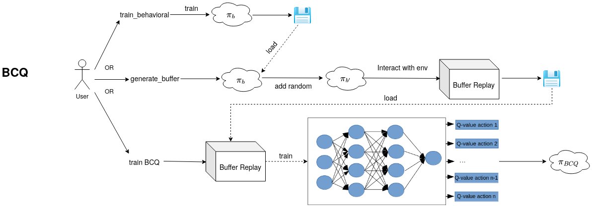
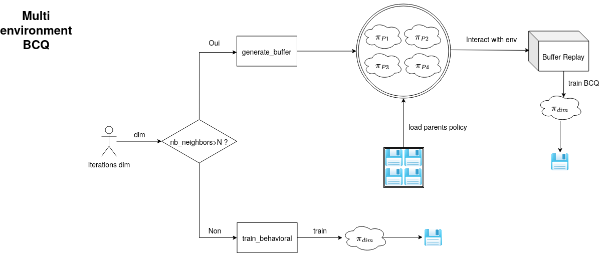

# Transfert_Learning

Bienvenue dans ce git construit pour essayer de transferer des politiques d'un agent de contrôle à l'autre. Le but est de passer d'un dimensionnement de microgrid à un autre en minimisant le temps d'entraînement de l'agent avant la convergence de sa politique.

### Principe :

Pour chaque itération du dimensionnement du micro-réseau (dont on ne s'intéresse pas pour le moment), on observe les dimensionnements sur lesquels un agent a déjà été entraîné.
Si la distance euclidienne entre les variables de dimensionnement de l'environnement actuel et d'autres environnements est inférieure à un seuil L, pour au moins N environnements, alors on réutilise la politique apprise sur ces environnements pour générer un buffer
et apprendre en batch RL. Si ce n'est pas le cas, l'agent apprend en on-line off-policy RL, il intéragit avec l'environnement directement et apprend grâce au DQN.

### Constitution du buffer

Le buffer doit venir des politique de contrôle des agents entraînés dans un environnement proche, ansi que sur un algorithme purement déterministe (rule based). Comme en BCQ, l'idée est de construire un buffer qui a un large pannel de couples actions/états visités. Pour celà, on rajoute du bruit (équivalent à de l'exploration), qu'importe l'origine de la politique
utilisée pour construire le buffer.

### Différences effectives par rapport à BCQ

* Première chose : Dans BCQ, il n'y a qu'un environnement. L'utilisateur spécifie au programme s'il veut entraîner un modèle from scratch (on-line en DQN), auquel cas il passera l'argument `train_behavioral` lors de l'execution du main. S'il veut utiliser une quelquonque politique, il peut utiliser l'argument `generate_buffer`.
Si aucun des deux n'est sur `True`, alors le script va utiliser le buffer qu'il a (ou pas) à disposition pour entraîner un agent de BCQ.



* Dans notre cas d'étude, on a plusieurs environnements. Un par dimensionnement du micro-réseau. Le but n'est pas de montrer que l'on est performant en Off-line mais de l'admettre pour le moment afin d'améliorer le temps de calcul. L'offline RL semble une bonne idée puisqu'une fois tout les tuples du  buffer collectés, il ne reste plus qu'à faire des mises-à-jours.
Ainsi, contrairement au papier du BCQ, pour chaque environnement, on cherchera à faire soit `train_behavioral` (s'il n'y a pas assez de dimensionnement proches de l'actuel, voir Principe), soit `generate_buffer` (suivi de `train_BCQ`) mais pas les deux l'un après l'autre.





Ainsi, il est nécessaire de créer un moyen de garder en mémoire les différents dimensionnement (=environnements) connus. Alors, pour chaque nouvelle itération, une fonction vérifiera le nombre de voisin et selon le résultat appelera `train_behavioral` ou `generate_buffer`. 
Les politiques doivent être sauvegardées dans tous les cas pour constituer un buffer dans le cas d'un ultérieur `generate_buffer`.
***
### Quels sont les prérequis ?

* gym
* stable-baselines
* pandas
* numpy
* matplotlib
* tensorflow version 1.15

Une fois les installations faites, se placer dans le dossier Control/microgrid, sous l'environnement python qui contient les packages puis taper : 
```
pip install -e microgrid
```
